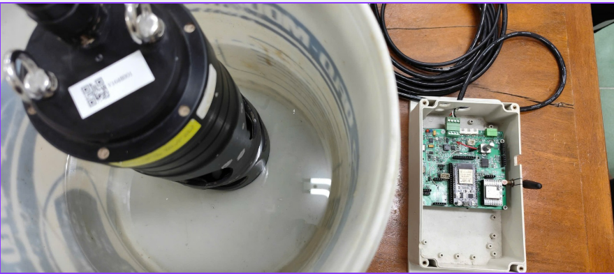

## 🌊 Hệ thống quan trắc chất lượng nước sử dụng IoT & Machine Learning

---

## 📌 Giới thiệu

   
  <em>Sơ đồ tổng thể hệ thống IoT giám sát chất lượng nước</em>

Dự án xây dựng hệ thống **giám sát chất lượng nước trong nuôi trồng thủy sản ngoài biển** theo thời gian thực.

Hệ thống sử dụng:
- ESP32 + LoRa để thu thập và truyền dữ liệu  
- Cảm biến đo các thông số nước (pH, nhiệt độ, độ mặn, ...)  
- Machine Learning để phân tích và cảnh báo  

👉 Mục tiêu: giúp người nuôi theo dõi từ xa và phát hiện sớm rủi ro.

---

## 🧠 Công nghệ sử dụng

- Phần cứng: ESP32, LoRa RA-01, cảm biến nước  
- Giao tiếp: RS485 (Modbus RTU), SPI, WiFi  
- Machine Learning: Prophet  
- Server & Web Dashboard  

---

## 🔧 Phần cứng

   
  <em>Thiết bị phần cứng thực tế</em>

   
  <em>Cảm biến đo chất lượng nước</em>

---

## 📊 Kết quả

   
  <em>Giao diện giám sát thời gian thực</em>

   
  <em>Kết quả thực nghiệm và phân tích dữ liệu</em>

